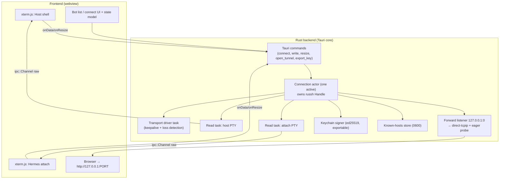
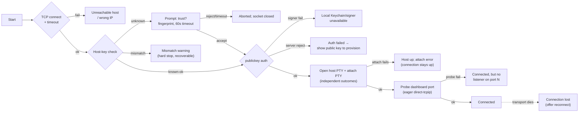

# feat: Botbox — embedded-SSH client for remote Hermes bots (macOS v1)

## Summary

Build Botbox v1 as a Tauri 2 macOS app with a Rust backend that holds one
embedded `russh` connection at a time and multiplexes a host-shell terminal, a
Hermes-attach terminal, and a dashboard port-forward onto it. The frontend renders
terminals with xterm.js fed by Tauri `ipc::Channel` byte streams. SSH keys are
ed25519 held in the macOS Keychain behind a signer abstraction, with an explicit
export action; connecting to a new bot tears down the previous connection only
after the new one authenticates.

---

## Problem Frame

Reaching a remote Hermes agent today means hand-rolling SSH: generate a key, get
it onto the box, remember IPs, open a shell, attach to the running session, and set
up a port-forward before the dashboard is reachable. That is tedious once and worse
to repeat from a second laptop or a phone where a usable `ssh` binary may not exist
(see origin: `docs/brainstorms/2026-06-26-botbox-ssh-client-requirements.md`). Botbox
collapses that into a few clicks. The embedded-client + Keychain choices are not
incidental — they are what let the same key and the same codepath work across
macOS today and iOS later, which shelling out to system `ssh` cannot do.

---

## Requirements

Traceability is to the origin requirements doc (R-IDs), actors (A-IDs), flows
(F-IDs), and acceptance examples (AE-IDs).

**Key management**

- R1. Generate an ed25519 keypair on demand; store the private key in the macOS
  Keychain. (origin R1 — origin asked for "Secure Enclave where available";
  v1 intentionally defers Secure Enclave per KTD2 and uses a Keychain item.)
- R2. Display the public key for one-action copy from an always-available surface
  (not only on auth failure); leave a path to send it to AI Power Guild later.
  (origin R2)
- R3. Never require the operator to handle the private key file in normal use, and
  never return private-key material over IPC or to logs — but provide an explicit,
  opt-in export action that writes the private key to an operator-chosen path.
  (origin R3)
- R17. Provide an explicit "export private key" action that writes an OpenSSH
  private key file with `0600` permissions to a path the operator chooses, behind
  a confirmation that warns the key is leaving the Keychain.

**Bot inventory**

- R4. Add a bot as name + IP; edit and remove later. (origin R4)
- R5. Persist saved bots across launches and list them for selection. (origin R5)
- R6. Carry per-bot config for the Hermes attach command and the dashboard remote
  port, each with a default. (origin R6)

**Connection and terminals**

- R7. Connect to the selected bot over the embedded `russh` client using the
  Keychain-held key, authenticating once per connection. A new bot's connection is
  validated through authentication before any currently active bot is torn down.
  (origin R7)
- R8. Show an interactive host-shell terminal in the UI. (origin R8)
- R9. Show a second terminal that runs the bot's configured attach command to reach
  the live Hermes session. (origin R9)
- R10. Run both terminals over the single SSH connection. (origin R10)
- R11. Distinguish, in surfaced errors: unreachable host, untrusted/changed host
  key, remote auth failure (unprovisioned key), local signer/Keychain failure,
  wrong dashboard port, and mid-session connection loss. (origin R11)

**Dashboard tunnel**

- R12. Forward the bot's configured dashboard port to a loopback localhost port and
  report the local URL. (origin R12)
- R13. Open the default browser at the tunneled local URL. (origin R13)

**Project shape**

- R14. Build with Tauri 2, producing an installable macOS bundle (Windows/iOS
  later). (origin R14)
- R15. Open source with documented code and a configuration-driven path to other
  bot types (OpenClaw, etc.) rather than a core fork. (origin R15)

**Security and trust**

- R16. Verify the host key on first connection (trust-on-first-use), persist
  accepted host keys, and hard-stop with a distinct, recoverable warning on key
  mismatch. (origin R16)
- R18. Define the webview↔backend trust boundary explicitly: a strict CSP and a
  command/permission allowlist so only the needed backend commands are reachable.

---

## Key Technical Decisions

- **KTD1 — Embedded `russh` client, not system `ssh`.** `russh` (Eugeny, actively
  maintained, used by VS Code Remote SSH and Bitwarden's SSH agent) supports PTY
  channels, multiplexing, `direct-tcpip` forwarding, and ed25519. Confirms the
  origin Key Decision and keeps one codepath across macOS/iOS. (origin: embedded
  SSH client decision)

- **KTD2 — ed25519 in the Keychain behind a `Signer` trait; key is exportable.**
  The origin leaned on the Secure Enclave "where available," but the Enclave only
  supports P-256 ECDSA and produces a non-extractable key requiring a custom
  `SecKeyCreateSignature` signer. v1 generates ed25519 and stores the private key
  as a Keychain item scoped to the app bundle with
  `kSecAttrAccessibleWhenUnlockedThisDeviceOnly`. The key is deliberately
  extractable: `russh` signs with the key bytes in-process, and the operator can
  export it (R17). The `Signer` trait exposes the public key **and its SSH
  algorithm identifier**. A future hardware-backed P-256/Secure-Enclave signer is
  a **key-rotation event**, not a transparent swap — it changes the wire algorithm
  and the public key, so every bot must be re-provisioned. The trait keeps that
  migration confined to the signer, but it is not invisible to operators.

- **KTD3 — Connection-actor-per-bot; one active connection, validate-before-swap.**
  Each bot connection is an actor (a task owning the `russh` `Handle` plus an mpsc
  command channel). The `Handle` is `Clone + Send`; one driver task processes
  transport, separate read tasks pump each channel. Only one connection is active
  at a time — this resolves the origin's open question (one-vs-many) in favor of
  UI simplicity; multi-connection is deferred. When switching bots, the new
  connection is staged through host-key + auth on a provisional handle and the
  prior active connection is torn down only once the new one reaches the
  authenticated stage. If the new connection fails, the prior one is preserved (or,
  if it cannot be, its loss is surfaced explicitly with a reconnect affordance).

- **KTD4 — PTY bytes stream over Tauri `ipc::Channel` as raw bytes.** Use
  `tauri::ipc::Channel` with `InvokeResponseBody::Raw`, not the event system, for
  ordered binary streaming. Do not UTF-8 decode in Rust (xterm.js handles
  multibyte sequences split across reads); coalesce small reads before sending.
  Input flows xterm.js `onData` → command → `channel.data`; resize flows
  `FitAddon`/`onResize` → command → `channel.window_change` (debounced).

- **KTD5 — Host-key TOFU with a known-hosts store; bounded prompt; recoverable
  mismatch.** `russh`'s `check_server_key` gates the handshake. On first contact,
  pause and surface the SHA-256 fingerprint to the UI via a oneshot the operator
  resolves with Trust/Reject; persist on accept. The prompt is a blocking modal
  with an explicit timeout (default 60s) that auto-rejects, closes the TCP socket,
  and aborts the parked handshake task — an abandoned prompt never leaks a
  half-open connection. On mismatch, hard-stop with a distinct warning that shows
  the saved vs presented fingerprint and requires an explicit "Remove saved key for
  this host" action before any re-trust; never silently update. Future: the AI
  Power Guild app can distribute known host keys to a fresh Botbox so it can
  pre-trust hosts (deferred — see Scope Boundaries).

- **KTD6 — Staged connect pipeline with per-stage error tagging.** Run connect as
  TCP-connect → host-key check → publickey auth → open channels → probe dashboard
  port, and tag each failure with its stage. This is the mechanism behind R11/R16.
  Error classes:
  - *Unreachable host* — TCP connect fails/times out.
  - *Untrusted/changed host key* — `check_server_key` unknown (prompt) or mismatch
    (hard stop).
  - *Remote auth failure* — server rejects the key → route to the provision-your-
    key surface.
  - *Local signer/Keychain failure* — the `Signer` cannot produce a signature
    (Keychain locked, OS prompt cancelled, item missing) → a class distinct from
    remote auth rejection, so the operator is **not** sent to re-paste a correct key.
  - *Wrong dashboard port* — see KTD7; classified at connect via an eager probe.
  - *Connection lost* — the driver task observes transport close or keepalive
    failure mid-session → a distinct state surfaced with the v1 manual-reconnect
    affordance, not frozen terminals.
  - *Partial channel open* — the host-shell PTY and the attach PTY open
    independently; host-up/attach-failed keeps the connection up and surfaces an
    attach-specific error rather than aborting the working host shell.

- **KTD7 — Loopback-only port forward, OS-assigned port, eager port probe.** Bind a
  `TcpListener` to `127.0.0.1:0`, read back the assigned port (avoids a TOCTOU
  port race), and `copy_bidirectional` each accepted stream against a `direct-tcpip`
  channel. Never bind `0.0.0.0`. At connect, eagerly open one probe `direct-tcpip`
  channel to the dashboard host:port to classify a wrong port before reporting
  "connected", then close it; a per-accept open failure later is surfaced rather
  than left to hang the browser. Open the browser at `http://127.0.0.1:<port>` only
  after the listener is bound and the connection is authenticated. Listener
  lifecycle is a child of the connection actor. **Accepted v1 risk:** the loopback
  listener is reachable by any local process running as the same user; for a
  single-operator desktop this is accepted and documented (a single-use access
  token is deferred — see Scope Boundaries).

- **KTD8 — Webview↔backend trust boundary is an explicit security control.** In
  `tauri.conf.json`, set a strict CSP (no `unsafe-inline`/`unsafe-eval`), enumerate
  only the backend commands the frontend needs in the permission allowlist, and
  disable unused plugin scopes. This is configured in U1, not left to defaults,
  because retrofitting CSP onto an existing Tauri app is error-prone and the
  terminal renders untrusted remote bytes. (R18)

- **KTD9 — Explicit connection/terminal state model.** A single state machine drives
  the UI: *idle* (no active connection — terminals show a "select a bot and connect"
  placeholder, empty bot list shows a first-run CTA), *connecting* (per-pipeline-
  stage progress; trust prompt appears as a modal at the host-key stage),
  *connected* (live PTY), *disconnected* (operator-initiated or clean teardown), and
  *connection-lost* (unexpected; offers reconnect). Every unit that changes
  connection status maps its transitions onto these states so the implementer does
  not invent them.

- **KTD10 — Local data-dir hardening.** The known-hosts store and bot inventory are
  written with `0600` permissions at creation; the local-tamper threat (an attacker
  who can write these files can pre-trust a malicious host and defeat TOFU silently)
  is documented. HMAC-over-a-Keychain-key integrity protection is noted as a
  follow-up.

---

## High-Level Technical Design

**Backend architecture — one active connection actor multiplexing three channel
types to the webview:**



**Staged connect pipeline — each stage maps to a distinct error class (R11/R16):**



These diagrams are authoritative for component boundaries and the connect sequence;
per-unit detail follows below.

---

## Output Structure

Greenfield layout (per-unit `**Files:**` are authoritative; the tree is the
expected shape):

```
botbox/
├── src-tauri/
│   ├── Cargo.toml
│   ├── tauri.conf.json          # CSP + permission allowlist (KTD8)
│   └── src/
│       ├── main.rs
│       ├── lib.rs
│       ├── commands.rs          # Tauri command surface
│       ├── ssh/
│       │   ├── mod.rs
│       │   ├── connection.rs     # connection actor + driver + loss detection
│       │   ├── pipeline.rs       # staged connect + error classes
│       │   ├── channels.rs       # host + attach PTY read/write/resize
│       │   ├── forward.rs        # loopback port-forward + eager probe
│       │   ├── signer.rs         # Signer trait (+ algo id) + ed25519 impl + export
│       │   └── known_hosts.rs    # TOFU store (0600)
│       ├── keychain.rs           # Keychain storage (security-framework)
│       └── store.rs              # bot inventory persistence (0600)
├── src/                          # frontend
│   ├── index.html
│   ├── main.ts
│   ├── state.ts                  # connection/terminal state model (KTD9)
│   ├── terminal.ts               # xterm.js wiring
│   ├── bots.ts                   # bot list/select UI + states
│   └── styles.css
├── package.json
├── README.md
├── CONTRIBUTING.md
├── LICENSE
└── docs/
    └── extending-to-other-bots.md
```

---

## Implementation Units

### U1. Tauri 2 macOS scaffold + state model + CSP

- **Goal:** Stand up a buildable Tauri 2 app (macOS target) with a Rust backend, a
  frontend bundling xterm.js, the connection/terminal state model, a strict CSP +
  permission allowlist, and a first-run empty state (no SSH yet).
- **Requirements:** R14, R18.
- **Dependencies:** none.
- **Files:** `src-tauri/Cargo.toml`, `src-tauri/tauri.conf.json`,
  `src-tauri/src/main.rs`, `src-tauri/src/lib.rs`, `package.json`,
  `src/index.html`, `src/main.ts`, `src/state.ts`, `src/terminal.ts`,
  `src/styles.css`.
- **Approach:** Tauri 2 with a light frontend; install `@xterm/xterm` +
  `@xterm/addon-fit` (+ WebGL addon). Implement the KTD9 state model: idle (terminals
  show a "select a bot and connect" placeholder; empty bot list shows a first-run
  CTA toward generate-key → add-bot), with connecting/connected/disconnected/
  connection-lost transitions stubbed for later units. Configure `tauri.conf.json`
  with a strict CSP (no `unsafe-inline`/`unsafe-eval`) and a permission allowlist
  enumerating only needed commands, with unused plugin scopes disabled (KTD8).
- **Patterns to follow:** `marc2332/tauri-terminal` and `Tnze/tauri-plugin-pty` for
  xterm.js wiring (study only; no local PTY needed).
- **Test scenarios:**
  - Idle state renders the terminal placeholders and the first-run CTA on an empty
    bot list.
  - `Test expectation: CSP/permissions config is asserted present` — a smoke check
    that the allowlist excludes commands the frontend does not use.
- **Verification:** `cargo tauri build` produces a macOS bundle; launching shows the
  idle state with placeholders and a first-run CTA; CSP/permissions are set.

### U2. SSH key generation + Keychain storage + signer abstraction + export

- **Goal:** Generate an ed25519 keypair, store the private key in the Keychain,
  expose the public key from an always-available surface, and provide an explicit
  export action — all behind a `Signer` trait that also reports its algorithm id.
- **Requirements:** R1, R2, R3, R17. Covers AE1.
- **Dependencies:** U1.
- **Files:** `src-tauri/src/ssh/signer.rs`, `src-tauri/src/keychain.rs`,
  `src-tauri/src/commands.rs`, `src-tauri/src/ssh/signer_test.rs`, `src/main.ts`.
- **Approach:** Define `trait Signer` (sign a challenge, expose public key, expose
  SSH algorithm id). v1 impl generates ed25519 via `ssh-key`/`russh-keys`, stores
  the private key as a Keychain generic item via `security-framework` with
  `kSecAttrAccessibleWhenUnlockedThisDeviceOnly` scoped to the bundle id. A
  `get_public_key` command returns the OpenSSH public string from an
  always-available UI surface. An `export_key` command writes the OpenSSH private
  key to an operator-chosen path with `0600`, behind a confirmation warning. Wrap
  in-memory private bytes in a zeroize-on-drop type with a redacting `Debug`; the
  private key is never returned over IPC except through the explicit export path.
- **Patterns to follow:** `security-framework` Keychain item APIs.
- **Test scenarios:**
  - Generating a key when none exists stores a private item and returns a valid
    OpenSSH ed25519 public string; the signer reports algorithm `ssh-ed25519`.
  - Generating when a key already exists returns the existing public key (idempotent).
  - Covers AE1. The private key is never returned by any command except `export_key`
    and never appears in a `Debug`/log rendering.
  - `export_key` writes a parseable OpenSSH private key with `0600` permissions to
    the chosen path.
  - Public-key command output round-trips as a parseable ed25519 key.
- **Verification:** Public key copyable from a persistent surface; export produces a
  usable `0600` key file; Keychain shows the item; no non-export command exposes
  private material.

### U3. Bot inventory (persisted, 0600) with per-bot config + list states

- **Goal:** Add/edit/remove/select bots, persisted across launches with `0600`
  perms, each with attach command and dashboard port defaults; define the bot-list
  visual states.
- **Requirements:** R4, R5, R6.
- **Dependencies:** U1.
- **Files:** `src-tauri/src/store.rs`, `src-tauri/src/commands.rs`,
  `src-tauri/src/store_test.rs`, `src/bots.ts`.
- **Approach:** Persist a bot list (name, IP, attach command, dashboard port) to the
  app data dir as JSON written `0600` (KTD10). Defaults applied on add when fields
  are blank. Commands: `list_bots`, `add_bot`, `update_bot`, `remove_bot`,
  `select_bot`. Bot-list item states: default (not connected), connected
  (highlighted, exposes Disconnect), transitioning (during teardown+connect, list
  locked); switching while connected confirms before disconnecting the active bot.
- **Patterns to follow:** Tauri app-data-dir path resolution.
- **Test scenarios:**
  - Adding a bot with name + IP persists with `0600` and reloads after a simulated
    restart.
  - Adding with blank attach command / port applies the defaults.
  - Editing changes only the targeted bot; removing deletes only it.
  - The store file is created with owner-only (`0600`) permissions.
  - Names/IPs with surprising characters round-trip without corrupting the store.
- **Verification:** Bots survive relaunch; file perms are `0600`; list shows
  connected/transitioning states.

### U4. Connection actor + staged connect pipeline + TOFU + loss detection

- **Goal:** Connect over `russh` with validate-before-swap semantics, TOFU host-key
  verification (bounded prompt, recoverable mismatch), keepalives, mid-session loss
  detection, and clean teardown.
- **Requirements:** R7, R16, R11. Honors A2.
- **Dependencies:** U2, U3.
- **Files:** `src-tauri/src/ssh/connection.rs`, `src-tauri/src/ssh/pipeline.rs`,
  `src-tauri/src/ssh/known_hosts.rs`, `src-tauri/src/commands.rs`,
  `src-tauri/src/ssh/pipeline_test.rs`, `src-tauri/src/ssh/known_hosts_test.rs`.
- **Approach:** Connection actor owns the `russh` `Handle`. On switch, stage the new
  connection through host-key + auth on a provisional handle and tear down the prior
  active connection only after the new one authenticates (KTD3). Staged pipeline
  (KTD6) tags errors per stage, including a local-signer-failure class distinct from
  remote auth rejection. `check_server_key` consults the known-hosts store (written
  `0600`); unknown → emit fingerprint to UI and await a oneshot with a 60s timeout
  that auto-rejects, closes the socket, and aborts the handshake task; mismatch →
  hard error showing saved vs presented fingerprint, requiring an explicit "remove
  saved key" before re-trust. The driver task configures `keepalive_interval` and
  emits a connection-lost state on transport close/keepalive failure.
- **Execution note:** Start with a failing test for the connect-stage → error-class
  mapping before wiring `russh`.
- **Patterns to follow:** `russh` `client::Handler::check_server_key`; the oneshot
  must be installed into the handler before `connect()` is driven (the callback
  runs inside the handshake). HTTP/2-style driver-task + cloned-handle concurrency.
- **Test scenarios:**
  - Unreachable host (closed port / bad IP / timeout) yields the unreachable class.
  - Covers AE3. A reachable host that rejects the key yields the remote-auth-failure
    class distinct from unreachable.
  - A local signer/Keychain failure (cancelled prompt, locked Keychain) yields the
    signer-failure class and does NOT route to the provision-your-key surface.
  - First contact with an unknown host key surfaces a trust prompt and, on accept,
    persists the key.
  - An unresolved trust prompt times out after 60s, closes the TCP socket, and
    aborts the parked handshake task with no leaked socket.
  - A known host presenting a changed key yields the recoverable mismatch hard-stop;
    re-trust requires the explicit remove-saved-key step.
  - Switching A→B where B fails auth leaves A intact (or surfaces A's loss with a
    reconnect affordance); a successful B tears A down after B authenticates.
  - A transport that dies mid-session surfaces the connection-lost state with a
    manual-reconnect affordance rather than freezing.
- **Verification:** Authenticates to a real/containerized bot; failed switches don't
  strand the operator; abandoned prompts and dead transports clean up.

### U5. Host-shell + Hermes-attach PTY channels streaming to xterm.js

- **Goal:** Open two independent PTY channels, stream output to the right xterm
  instance, forward input + resize, and drive the connected/disconnected terminal
  states.
- **Requirements:** R8, R9, R10, R11 (partial-open). Covers AE2.
- **Dependencies:** U4.
- **Files:** `src-tauri/src/ssh/channels.rs`, `src-tauri/src/commands.rs`,
  `src-tauri/src/ssh/channels_test.rs`, `src/terminal.ts`, `src/state.ts`.
- **Approach:** For each terminal, `request_pty` + shell (host) or exec/shell of the
  configured attach command (Hermes), opened as **independent** outcomes: a host-up/
  attach-failed result keeps the connection up and surfaces an attach-specific error
  rather than aborting (KTD6). A read task per channel forwards
  `ChannelMsg::Data`/`ExtendedData` to a per-terminal `ipc::Channel`
  (`InvokeResponseBody::Raw`, no Rust-side UTF-8 decode, coalesced). Input:
  `pty_write` → `channel.data`. Resize: `pty_resize` → `channel.window_change`
  (initial size in `request_pty`; debounce ~50–100 ms; first resize after a short
  delay to avoid the dropped-SIGWINCH pitfall). Terminals reflect connected → live
  PTY and disconnected/connection-lost → banner with locked input (KTD9).
- **Execution note:** Filling the real default attach command and dashboard port
  from a live bot is a gate for U5 "done" — the differentiating Hermes-attach path
  must be validated against a real bot, not declared complete against placeholders.
- **Patterns to follow:** `russh` channel `wait()`/`ChannelMsg` loop; Tauri `Channel`
  wiring from `Tnze/tauri-plugin-pty`.
- **Test scenarios:**
  - Covers AE2. The Hermes terminal runs the bot's default attach command when
    unset, and the override when set.
  - Host-shell output reaches the host terminal; attach output reaches the attach
    terminal (no cross-routing).
  - Host PTY opens but the attach command fails: the connection stays up and an
    attach-specific error is surfaced (host shell remains usable).
  - A multibyte UTF-8 sequence split across two reads renders intact.
  - Resize updates remote PTY dimensions.
  - Disconnect / connection-lost transitions the terminals to the banner+locked
    state.
- **Verification:** Both terminals interactive over one connection; `vim`/`htop`
  render correctly; attach reaches the live Hermes session against a real bot.

### U6. Dashboard port-forward + eager probe + tunnel UI

- **Goal:** Forward the dashboard port to a loopback port tied to the connection,
  classify a wrong port at connect, surface tunnel status, and open the browser.
- **Requirements:** R12, R13, R11 (wrong-port). Covers AE4.
- **Dependencies:** U4.
- **Files:** `src-tauri/src/ssh/forward.rs`, `src-tauri/src/commands.rs`,
  `src-tauri/src/ssh/forward_test.rs`, `src/main.ts`, `src/state.ts`.
- **Approach:** Bind `TcpListener` on `127.0.0.1:0`; read assigned port. At connect,
  eagerly open one probe `direct-tcpip` channel to the dashboard host:port to
  classify a wrong port before reporting connected, then close it (KTD7). Per
  accepted connection, open `channel_open_direct_tcpip` and `copy_bidirectional`; a
  per-accept open failure is surfaced, not left to hang the browser. Return the
  local URL; open default browser (`tauri-plugin-opener`) at `http://127.0.0.1:<port>`
  only after bind + auth. Tunnel UI: a status line in the connected view with the
  copyable local URL, an active/inactive badge that goes inactive on teardown, and
  an explicit "Open Dashboard" button. Listener task is a child of the connection
  actor; dropped on teardown.
- **Approach note (accepted risk):** the loopback listener is reachable by any local
  process as the same user; accepted for the single-operator v1 and documented
  (single-use token deferred — see Scope Boundaries).
- **Patterns to follow:** `direct-tcpip` + `copy_bidirectional` (the DEV.to russh
  port-forward pattern).
- **Test scenarios:**
  - Forward binds to 127.0.0.1 (never 0.0.0.0) and reports the OS-assigned port.
  - A request to the local port reaches the remote dashboard port (integration vs a
    bot/container serving a known response).
  - Covers AE4. A wrong dashboard port is classified at connect via the eager probe
    as "nothing listening on port N", distinct from an SSH-down error.
  - A per-accept `direct-tcpip` open failure after a healthy connect is surfaced
    (not a silent browser hang).
  - Tearing down / switching bots stops the listener, aborts in-flight forwards, and
    flips the tunnel badge to inactive.
- **Verification:** Browser opens the tunneled dashboard; tunnel status reflects
  active/inactive; closing the connection frees the port.

### U7. Error-class UX + provisioning + disconnect

- **Goal:** Render every error class from the pipeline as distinct, actionable UI,
  including provisioning, mismatch recovery, signer-failure, connection-lost, and an
  explicit Disconnect action.
- **Requirements:** R11 (UI), R2 (provisioning), R16 (mismatch UX).
- **Dependencies:** U4. (U6 is a verification gate for live wrong-port, not a code
  dependency — all error classes are emitted by U4's pipeline.)
- **Files:** `src-tauri/src/commands.rs`, `src/main.ts`, `src/bots.ts`,
  `src/state.ts`, `src/styles.css`.
- **Approach:** Map each error class to a specific message and next action:
  unreachable (retry/check IP); untrusted host (trust prompt with fingerprint);
  mismatch (saved vs presented fingerprint + explicit remove-saved-key recovery);
  remote auth failure (inline public key + copy); local signer failure (Keychain/
  unlock guidance, not "provision your key"); wrong dashboard port ("nothing
  listening on port N"); connection-lost (reconnect affordance). Add an explicit
  Disconnect action in the connected view and define the resulting disconnected
  state.
- **Test scenarios:**
  - Covers AE3. Remote auth failure renders the provisioning surface (public key +
    copy), not a generic error.
  - A local signer/Keychain failure renders unlock guidance, not the provisioning
    surface.
  - Mismatch renders saved vs presented fingerprints and the remove-saved-key
    recovery action.
  - Connection-lost renders a distinct state with a reconnect affordance.
  - The explicit Disconnect action tears down the connection and reaches the
    disconnected state.
- **Verification:** Each failure mode shows the right message and next step; no
  collapsing into one generic error; Disconnect works.

### U8. Open-source packaging + extensibility docs

- **Goal:** Ship an installable macOS build and the open-source scaffolding,
  including how to extend to other bot types.
- **Requirements:** R14, R15.
- **Dependencies:** U1–U7.
- **Files:** `src-tauri/tauri.conf.json` (bundle config), `README.md`,
  `CONTRIBUTING.md`, `LICENSE`, `docs/extending-to-other-bots.md`.
- **Approach:** Finalize macOS bundle/signing config (note Keychain entitlement
  needs). README covers install, key provisioning + export, and adding a bot.
  Document that other bot types (OpenClaw) are supported by configuring connection +
  attach behavior per bot, not by forking core logic.
- **Test scenarios:** `Test expectation: none — packaging/docs`.
- **Verification:** A clean checkout builds a distributable macOS bundle; docs let a
  contributor add a new bot type via config.

---

## Scope Boundaries

**Deferred for later** (from origin)

- AI Power Guild API integration: pulling bot IPs from `aisupply` and pushing the
  public key for provisioning. v1 is manual copy/paste.
- Windows and iOS builds. Architecture keeps them open; v1 ships macOS.

**Deferred to Follow-Up Work** (plan-local sequencing)

- Hardware-backed P-256 / Secure-Enclave signer behind the `Signer` trait (a
  key-rotation event, not a transparent swap — see KTD2).
- Guild-distributed known host keys to a fresh Botbox install (extends KTD5).
- Multiple concurrent bot connections (architecture supports it; v1 UI is single
  active).
- Auto-reconnect with backoff (v1 detects loss and offers manual reconnect; tmux
  attach makes reattach graceful).
- Single-use access token on the loopback forward, and HMAC integrity protection on
  the local data-dir stores (v1 ships `0600` perms + documented threat).

**Outside this product's identity** (from origin)

- Not a general-purpose SSH manager or full terminal-emulator replacement.
- No multi-user, team-sharing, or fleet-orchestration model.
- Botbox does not provision or manage the bots themselves (that is AI Power Guild's
  job).

---

## Risks & Dependencies

- **`russh` channel concurrency.** Concurrent read/write on a channel needs the
  driver-task + cloned-`Handle` split, not a shared `&mut Session`. Mitigation:
  follow the HTTP/2-style pattern; cover with the U4/U5 tests.
- **Keychain access UX.** First private-key use may trigger an OS auth prompt; a
  cancelled prompt or locked Keychain surfaces as the signer-failure class (U4).
- **Local data-dir tamper.** Known-hosts/bot-store tampering can defeat TOFU;
  mitigated by `0600` perms + documented threat, with HMAC integrity deferred.
- **Loopback forward exposure.** Any local process as the same user can reach the
  tunneled dashboard; accepted for v1, token deferred.
- **iOS backgrounding (future).** iOS suspends Tokio after ~30s background, dropping
  SSH; tmux attach makes reattach graceful. Documented now, handled when iOS lands.
- **`aws-lc-rs`/`ring` C build for future iOS.** `russh` needs one crypto backend
  with a C build step; verify the iOS cross-compile chain before committing to iOS.

---

## Outstanding Questions

**Resolve before U5 is done**

- The real default Hermes attach command (exact `tmux attach` / `docker exec` form)
  and the default dashboard remote port, filled and validated from a live bot. U5's
  differentiating path is not "done" against placeholders (gate in U5).

**Deferred to implementation**

- Exact `russh` crypto-backend feature flag (`aws-lc-rs` vs `ring`) — settle when
  the iOS build chain is evaluated; macOS works with either.
- Exact trust-prompt timeout value (default 60s) and keepalive interval — tune
  during implementation.

---

## Sources & Research

- Origin: `docs/brainstorms/2026-06-26-botbox-ssh-client-requirements.md`.
- `russh` (Eugeny) — actively maintained async Rust SSH; PTY channels,
  multiplexing, `direct-tcpip`, ed25519; used by VS Code Remote SSH and Bitwarden's
  SSH agent. Shapes KTD1, KTD3, U4–U6.
- Apple Secure Enclave supports only P-256 ECDSA (no ed25519/RSA) and produces
  non-extractable keys → KTD2 (ed25519-in-Keychain for v1, exportable, `Signer`
  trait with algorithm id for the future hardware-backed key-rotation path).
  `security-framework` crate for Keychain access.
- Tauri 2 `ipc::Channel` with `InvokeResponseBody::Raw` for ordered binary PTY
  streaming; no Rust-side UTF-8 decode; `window_change` on resize → KTD4, U5.
  Strict CSP + permission allowlist as the webview↔backend boundary → KTD8, U1.
- Loopback-only forward (`127.0.0.1:0`, OS-assigned), eager probe for wrong-port
  classification, `copy_bidirectional` over `direct-tcpip` → KTD7, U6.
- TOFU host-key verification via `check_server_key`, bounded prompt, recoverable
  mismatch → KTD5, R16, U4. Reference projects: `marc2332/tauri-terminal`,
  `Tnze/tauri-plugin-pty`.
