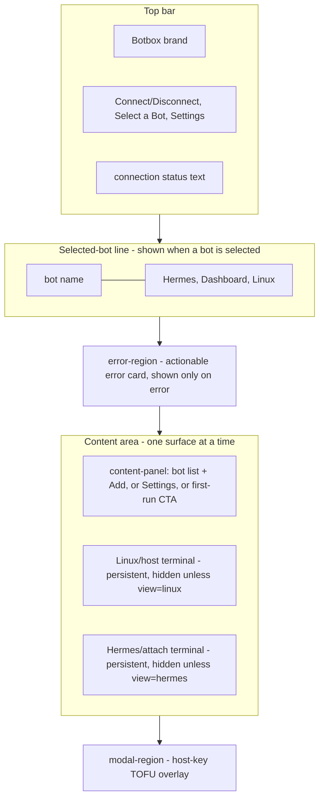
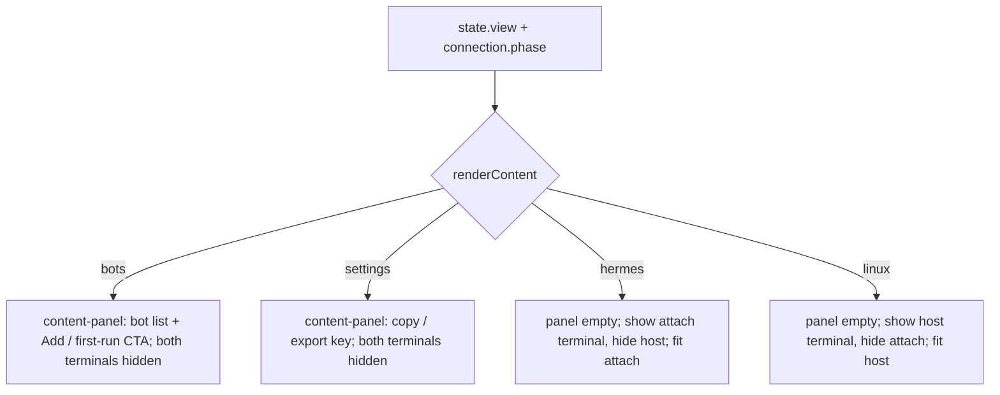

# refactor: Single-panel top-nav UI layout

## Summary

Replace Botbox's three-panel layout (a left config rail plus two always-visible
terminal panes) with a single-panel, top-navigation layout that shows **one
thing at a time** in a content area, matching the provided mockup. A top bar
carries the Botbox brand and `Connect` / `Select a Bot` / `Settings` nav; a
selected-bot line exposes `Hermes` / `Dashboard` / `Linux` context links; and a
single content area below shows whichever panel is active. This is a frontend
re-layout only — the entire Rust backend and the connect pipeline, host-key
trust prompt, error-class surfaces, and dashboard tunnel are reused unchanged.

---

## Problem Frame

The current UI renders everything simultaneously: a left sidebar (bot list, add
form, key panel) and two terminal panes (host shell + Hermes attach) side by
side, with a status bar, tunnel bar, and error region stacked in the workspace.
This is dense, wastes space when only one surface is in use, and cannot collapse
to a small/mobile screen. The redesign trades simultaneity for a single focused
panel selected from a top nav — simpler for users and a structure that a future
responsive pass can target. No backend or connection behavior changes.

---

## Requirements

### Layout and navigation

- R1. The UI shows one panel at a time in a single content area; the previous
  three-panel simultaneous layout (left rail + two terminals) is removed.
- R2. A top bar shows the `Botbox` brand and the nav controls `Connect`,
  `Select a Bot`, and `Settings`.
- R3. A selected-bot line shows the selected bot's name and the context links
  `Hermes`, `Dashboard`, `Linux`. It appears once a bot is selected and is
  absent when no bot is selected.

### Bot selection and connection

- R4. `Select a Bot` shows the bot list (name + IP) and an `Add` control in the
  content area; selecting a bot updates the selected-bot line and persists the
  selection across sessions (existing `get_inventory` / `select_bot` behavior).
- R5. A single phase-aware nav control connects to / disconnects from the
  selected bot: Connect when idle/disconnected, disabled `Connecting…` while
  connecting, Disconnect when connected, and Reconnect when connection-lost.
  Connection status (connecting stage, connected, lost) is surfaced in the
  header.
- R6. The existing connect pipeline, host-key trust prompt (TOFU), and
  error-class surfaces continue to function unchanged.

### Terminals and dashboard

- R7. The `Hermes` (agent attach) and `Linux` (host shell) terminals each render
  in the content area, one at a time, selected from the context links.
- R8. Switching between content panels preserves each terminal's live PTY
  session and scrollback — terminals are not torn down or reconnected on a view
  switch.
- R9. `Dashboard` opens the loopback dashboard in the default browser via the
  SSH tunnel (unchanged); the link is enabled only when the tunnel is active.

### Settings and onboarding

- R10. `Settings` shows the public-key controls (copy public key, export private
  key) in the content area.
- R11. From an empty inventory (no bots), the content area shows a first-run CTA
  that keeps both onboarding paths reachable: generate the SSH key and add the
  first bot — without first opening Settings.

---

## Key Technical Decisions

- Single store, add a `view` field to `AppState`: rather than a separate nav
  store, extend the existing KTD9 store so the one `store.subscribe(render)`
  pass reflects both connection and view changes. The reducer stays pure; a new
  `set-view` action is the only view mutation. (see `src/state.ts`)
- Persistent terminals, visibility-toggled — the load-bearing decision. Both
  `TerminalPane` xterm instances stay mounted for the app's lifetime (as today)
  and are shown/hidden via a CSS class, never destroyed on a view switch, so
  scrollback and the live PTY stream survive. Dynamic dialogs (bots, settings)
  render into a **separate** `content-panel` region via `replaceChildren`, so
  re-rendering a dialog never touches the terminal DOM/canvas. On showing a
  terminal, the router calls `pane.fit()` — xterm cannot measure a
  `display:none` element, so the fit must run after it becomes visible.
- Dashboard stays external-browser (decision): the `Dashboard` link triggers the
  existing `open_tunnel` / `open_dashboard` path (loopback URL in the default
  browser). No in-app webview, no CSP relaxation. Link enabled only when the
  tunnel is active.
- Connect/Disconnect consolidated in the top nav, phase-aware across all five
  connection phases: `Connect` (enabled) when idle/disconnected and a bot is
  selected; disabled and labeled `Connecting…` (kept visible — never hidden — so
  the nav does not reflow) while connecting; `Disconnect` when connected;
  `Reconnect` (wired to the same retry path as the connection-lost error card)
  when connection-lost; disabled when no bot is selected. The status-bar Connect
  button added in commit `fab95e8` and the per-bot-item Disconnect button are
  removed in favor of this single control.
- Auto-switch to Hermes on connect, via an explicit `onConnected` seam: the
  existing `ConnectionController` consumes the `connected` backend event inside
  `bind()` — `src/main.ts` has no hook today. Add an `onConnected?: (botId) =>
  void` callback to `ConnectionDeps`, invoked in `bind()`'s `connected` listener
  alongside the store dispatch, and wire it in `src/main.ts` to dispatch
  `set-view "hermes"`. The reducer stays pure. Partial-open handling: a connect
  can succeed with the host shell live but the Hermes attach failed (KTD6 partial
  open), which is only known after `open_terminals` resolves — landing the user
  on a Hermes view that shows only an attach-failure banner. On partial open
  (`attachOk === false`) the terminal controller switches the view to `linux`
  (the live host shell) so the user is never stranded on a dead Hermes pane.
- Error display ownership: error classes render only via `renderErrorSurface`
  into `#error-region` (above the content area, visible regardless of `view`).
  The repurposed `renderStatusBar` drops its `lastError` branch so an error is
  never double-rendered — the header status shows connection phase only.
- Responsive deferred: this plan delivers the single-column structure that makes
  a mobile layout achievable. Media-query breakpoints, touch sizing, and mobile
  testing are out of scope (see Scope Boundaries).

---

## High-Level Technical Design

New shell structure (regions stacked top to bottom; the content area shows one
surface at a time):

Content router: what the content area shows, derived from `state.view` (the
terminals are visibility-toggled siblings of the panel region, never destroyed):

---

## Implementation Units

### U1. View/navigation state

- Goal: Add the view dimension to the state model so a single store drives both
  connection and which content panel is active.
- Requirements: R1, R3, R7, R10
- Dependencies: none
- Files: `src/state.ts`, `src/state.test.ts`
- Approach: Add `export type ContentView = "bots" | "settings" | "hermes" |
  "linux";` and a `view: ContentView` field on `AppState` (default `"bots"` in
  `initialState`). Add a `{ type: "set-view"; view: ContentView }` action and a
  reducer case that sets `state.view` without touching connection state. Keep the
  reducer pure — the connected→hermes auto-switch is dispatched from the
  `onConnected` seam in U4, not here. Add a `hasSelectedBot(state): boolean`
  selector used by the nav and the selected-bot line.
- Patterns to follow: mirror the existing discriminated-action style and the
  `select-bot` reducer case in `src/state.ts`; tests mirror `src/state.test.ts`
  reducer-transition cases.
- Test scenarios:
  - `set-view` to each of `bots`/`settings`/`hermes`/`linux` updates
    `state.view` and leaves `connection` and `selectedBotId` untouched.
  - `initialState()` has `view === "bots"`.
  - A connection action (e.g., `begin-connect`) does not change `view`.
- Verification: state tests pass; `view` is part of `AppState` and defaults to
  `bots`.

### U2. Single-panel shell markup and layout CSS

- Goal: Replace the three-panel HTML scaffold with the single-column shell:
  header (brand + nav + status), selected-bot line, error region, content area
  (a dynamic content-panel region + the two persistent terminal containers), and
  the existing modal region.
- Requirements: R1, R2, R3
- Dependencies: none, but must land together with U3 and U4 — removing the old
  region ids (`#sidebar`, `#status-bar`, `#bot-list-region`, `#bot-form-region`,
  `#key-region`, `#tunnel-region`) breaks boot until U3/U4 move the `el(id)`
  call sites that resolve them (`el()` throws on a missing element). U2 is not
  independently bootable on its own.
- Files: `src/index.html`, `src/styles.css`
- Approach: Restructure `#app` into stacked regions: `header` containing the
  brand, a `#nav-region`, and a `#status-region`; a `#selected-bot-region`; the
  existing `#error-region`; a `main.content` containing `#content-panel` (the
  `replaceChildren` target for dialogs) and the two persistent terminal
  containers `#terminal-host` and `#terminal-attach`; and the existing
  `#modal-region`. Keep the terminal container ids so `createTerminals` still
  mounts into them. Add CSS for the single-column flow, the nav button row, the
  selected-bot line, a content area that fills remaining height, terminal
  containers that fill the content area, and a `.hidden` utility (`display:
  none`). Remove the `.sidebar` / two-up `.terminals` grid rules. No media
  queries (deferred).
- Patterns to follow: existing `src/styles.css` design tokens and the
  `.status-bar` / `.btn` / `.bot-item` styling already in the file; keep the AI
  Power Guild palette and `--term-*` variables.
- Test scenarios: Test expectation: none — pure markup/CSS, exercised by the
  render units (U3–U5) and manual verification.
- Verification: compiles; the new shell renders and `createTerminals` mounts
  into the two terminal containers once U3/U4 rewire the `el()` lookups (boot is
  verified at the end of U4).

### U3. Top-bar nav and selected-bot line

- Goal: Render the top-bar nav (Connect/Disconnect, Select a Bot, Settings) and
  the selected-bot line (name + Hermes/Dashboard/Linux links), wired to view
  switching, connect/disconnect, and the external-browser dashboard.
- Requirements: R2, R3, R5, R9
- Dependencies: U1, U2
- Files: `src/render.ts`, `src/main.ts`, `src/render-errors.test.ts` or
  `src/state.test.ts` (render tests)
- Approach: Add `renderNav(region, state, handlers)` rendering three controls:
  the phase-aware connect control (per the Connect/Disconnect KTD: `Connect` when
  idle/disconnected with a bot selected; disabled `Connecting…` while connecting;
  `Disconnect` when connected; `Reconnect` → `onReconnect` when connection-lost;
  disabled when no bot selected), `Select a Bot` (calls `onSetView("bots")`), and
  `Settings` (calls `onSetView("settings")`), with active-state styling keyed on
  `state.view`. Repurpose `renderStatusBar` into a compact header status
  indicator (connecting stage / connected / lost) rendered into `#status-region`,
  minus the Connect button (now in the nav) and minus the `lastError` branch
  (error display is owned solely by `renderErrorSurface` per the error-ownership
  KTD). Add `renderSelectedBotLine(region, state, handlers)` that renders nothing
  unless a bot is selected (visible in every phase once selected); otherwise the
  bot name plus links: `Hermes` → `onSetView("hermes")` and `Linux` →
  `onSetView("linux")` — both always navigable regardless of connection phase
  (the terminal shows its existing idle placeholder until connected, see U5) and
  each carrying an active style when it is the current `view`; `Dashboard` →
  `onOpenDashboard()`, enabled only when `connection.phase === "connected"` and
  `tunnel.active`, and never carrying an active style (it triggers an external
  browser action, not a view change). Wire all handlers in `src/main.ts`:
  `onSetView` dispatches `set-view`; `onConnect`/`onDisconnect`/`onReconnect`
  reuse the existing `connection.connect` / `connection.disconnect` /
  `retryConnect`; `onOpenDashboard` reuses the existing
  tunnel-open/open-dashboard path.
- Patterns to follow: the existing `button()` helper and `StatusBarHandlers`
  pattern in `src/render.ts` (commit `fab95e8`); the tunnel open/copy wiring in
  `renderTunnelBar` and the `retryConnect` reconnect path in `src/main.ts`.
- Test scenarios:
  - Nav renders exactly three controls; `Select a Bot` and `Settings` call
    `onSetView` with `bots` / `settings`.
  - Connect: with a bot selected and phase idle, renders an enabled `Connect`
    calling `onConnect` with the selected bot id; with no selection it is
    disabled.
  - Connect across phases: disabled and labeled `Connecting…` (still present)
    while `connecting`; renders `Disconnect` (calling `onDisconnect`) when
    `connected`; renders `Reconnect` (calling `onReconnect`) when
    `connection-lost`.
  - Selected-bot line: absent when `selectedBotId` is null; shows the bot name
    and the three links when a bot is selected — including while `connecting` and
    `connection-lost`.
  - `Hermes` / `Linux` links call `onSetView("hermes")` / `onSetView("linux")`
    and are navigable in every phase; the link matching `state.view` carries the
    active style; `Dashboard` never carries the active style.
  - Covers AE3. Dashboard link: disabled when not connected or the tunnel is
    inactive; calls `onOpenDashboard` when connected with an active tunnel.
  - Status indicator renders no error span even when `state.lastError` is set
    (error display is `renderErrorSurface`'s job).
  - Active-view styling: the nav control matching `state.view` carries the
    active class.
- Verification: clicking nav and links switches the active content/view; the
  connect control's label/action tracks all five phases; the header shows phase
  only (no error text).

### U4. Content-area router

- Goal: Route the content area off `state.view` — render bots/settings dialogs
  (and the first-run CTA) into `#content-panel`, and show/hide the two persistent
  terminal containers — without ever destroying the terminal DOM.
- Requirements: R1, R4, R7, R10, R11
- Dependencies: U1, U2, U3
- Files: `src/render.ts`, `src/main.ts`, `src/connection.ts` (add the
  `onConnected` dep), `src/render-errors.test.ts` (or a new
  `src/render-content.test.ts`)
- Approach: Add `renderContent(state, handlers)` that (a) renders the
  `#content-panel` via `replaceChildren`: `bots` → the first-run CTA when no bots
  else `renderBotList` + the add/edit form (moved out of the sidebar); `settings`
  → `renderKey` (the public-key copy/export panel, moved out of the sidebar);
  `hermes`/`linux` → empty panel; and (b) toggles the `.hidden` class on
  `#terminal-host` / `#terminal-attach` so exactly one shows for `linux`/`hermes`
  and both hide for `bots`/`settings`. When a terminal becomes visible, call its
  `setVisible(true)` (U5) to fit it. Move the bot-list/form and key-panel
  rendering from the sidebar regions into the content panel; the
  form-focus-preserving render (`renderBotFormPreservingFocus`, commit `fab95e8`)
  is reused as-is. First-run CTA (R11): keep both onboarding affordances — the
  existing `renderFirstRunCta` "Generate key" button (wired to the existing
  key-generation flow) and "Add a bot" — so a brand-new user with no key and no
  bot still has a path to generate a key without first opening Settings.
  Navigating away from a partially-filled Add form (clicking another nav item)
  silently discards the in-progress input — acceptable for this small form;
  note it so no confirmation guard is added. Auto-switch: wire the U1 `onConnected`
  seam in `src/main.ts` to dispatch `set-view "hermes"` on connect; on partial
  open (the terminal controller's `open_terminals` resolves with `attachOk ===
  false`), switch the view to `linux` instead so the user lands on the live host
  shell rather than a dead Hermes pane (see U5). Keep `render()` calling
  `renderContent` after the nav and selected-bot line.
- Patterns to follow: the current `render()` composition and `renderForm`
  wiring in `src/main.ts`; `renderBotList` / `renderKey` /
  `renderBotFormPreservingFocus` in `src/bots.ts` / `src/render.ts`.
- Test scenarios:
  - `view=bots` with bots present renders the bot list + Add into the content
    panel and hides both terminal containers.
  - Covers AE1/AE5. `view=bots` with no bots renders the first-run CTA with both
    a Generate-key control and an Add-a-bot control; with a remembered bot it
    renders the bot list with that bot marked selected.
  - `view=settings` renders the key copy/export panel and hides both terminals.
  - `view=linux` shows `#terminal-host`, hides `#terminal-attach`, and the panel
    is empty.
  - `view=hermes` shows `#terminal-attach`, hides `#terminal-host`.
  - Switching from `bots` to `settings` and back does not error and re-renders
    the panel each time (no leftover prior-panel nodes).
  - Covers AE2. Switching `linux` → `hermes` toggles visibility without calling
    any terminal teardown/open path (assert the terminal controller's open is not
    re-invoked on a view switch).
- Verification: each nav/link selection shows the right content; terminals show
  and hide without reconnecting.

### U5. Terminal visibility and fit-on-show lifecycle

- Goal: Make a terminal size correctly when its view becomes active and keep
  both panes alive (scrollback + live PTY) across hide/show, including the
  resize/SIGWINCH interaction when a terminal is revealed mid-session.
- Requirements: R7, R8
- Dependencies: U2, U4
- Files: `src/terminal.ts`, `src/terminals.ts` (partial-open view switch),
  `src/main.ts`, `src/terminals.test.ts`
- Approach: Add `setVisible(visible: boolean)` on `TerminalPane` (commit to this
  one signature — it handles both directions: on show it `fit()`s so xterm
  measures the now-laid-out container and forwards a `window_change` to the live
  PTY; on hide it is a no-op, no `pty_resize`). The router (U4) calls it when
  toggling the `.hidden` class. Do not `reset()` or re-`mount()` on show — the
  pane keeps its buffer. The `ResizeObserver` set up in `mount` observes the
  container element and does not need re-arming across display toggles (a
  zero-size notification while hidden is absorbed by the existing resize debounce
  + not-live guard). Both panes remain mounted for the app's lifetime; nothing in
  the router disposes them. Partial-open view switch: extend
  `TerminalController.openTerminals` so that when the result is partial open
  (`attachOk === false`, host live), it requests a view switch to `linux` (via an
  injected `onPartialOpen` / `setView` callback wired in `src/main.ts`), so the
  auto-switch-to-Hermes lands the user on the working host shell instead of the
  attach-failure banner.
- Patterns to follow: the existing `fit()`, `attachLive()`, and resize-debounce
  logic in `src/terminal.ts`; the keep-alive idempotency in
  `src/terminals.ts` `TerminalController`.
- Test scenarios:
  - Showing a previously-hidden pane calls `fit()` exactly once on show.
  - A live pane that is hidden then shown is NOT `reset()` and stays `live`
    (input still enabled) — buffer/scrollback preserved.
  - Hiding a pane (`setVisible(false)`) does not forward a `pty_resize`/teardown.
  - Covers AE2. Toggling between the two panes while connected keeps both
    `openedForBot` intact (no re-open) in the terminal controller.
  - Covers AE6. On a partial-open result (`attachOk === false`), the controller
    requests a switch to the `linux` view (the live host shell) rather than
    leaving the user on the Hermes attach-failure banner.
- Verification: switching to a terminal mid-session shows it correctly sized,
  input works, and scrollback from before the switch is intact; a partial open
  lands the user on the working Linux shell.

### U6. Remove legacy layout and migrate tests

- Goal: Delete the now-dead three-panel scaffolding and consolidate, then update
  the test suite to the new structure so the whole suite is green.
- Requirements: R1, R6
- Dependencies: U3, U4, U5
- Files: `src/render.ts`, `src/main.ts`, `src/index.html`, `src/styles.css`,
  `src/state.test.ts`, `src/render-errors.test.ts`, `src/bots.test.ts`
- Approach: Remove the old sidebar renderer path, the standalone status-bar
  Connect button (folded into the nav in U3), the separate tunnel bar (folded
  into the Dashboard link in U3), the per-bot-item Disconnect button (folded into
  the nav Connect/Disconnect), and any orphaned CSS/regions. Keep `renderKey`,
  `renderBotList`, `renderBotFormPreservingFocus`, `renderErrorSurface`, the
  host-key modal, and the connect/terminal controllers intact — only their mount
  points and call sites move. Update existing render tests that asserted the old
  DOM (sidebar, status-bar Connect, tunnel bar, bot-item Disconnect) to the new
  structure. Confirm `renderErrorSurface` still renders into `#error-region`
  above the content area so every error class (auth-failure with public key,
  mismatch recovery, wrong-port, connection-lost) shows regardless of the active
  view.
- Patterns to follow: existing test conventions in `src/*.test.ts`; the
  error-surface rendering already in `src/render.ts`.
- Test scenarios:
  - Covers AE4. With a surfaced `remote-auth-failure`, the error card (with the
    public key to paste) renders in `#error-region` while `view` is any of
    bots/settings/hermes/linux.
  - No test references the removed sidebar / status-bar-Connect / tunnel-bar /
    bot-item-Disconnect DOM; suite passes.
  - Host-key TOFU modal still mounts in `#modal-region` during `connecting`.
- Verification: `pnpm test` green; `pnpm build` (tsc) clean; manual pass shows no
  orphaned regions and all error classes still surface.

---

## Acceptance Examples

- AE1. Given a remembered bot and the app is idle, when it launches, then the
  selected-bot line shows the bot name, the content area shows the bot list with
  the bot selected, and `Connect` is enabled.
- AE2. Given a connected session, when the user clicks `Linux` then `Hermes`,
  then each terminal appears in turn in the content area with its live session
  and scrollback intact, and no reconnect or terminal re-open occurs.
- AE3. Given the app is not connected, the `Dashboard` link is disabled; given a
  connected session with an active tunnel, clicking `Dashboard` opens the
  loopback URL in the default browser.
- AE4. Given a connect attempt that fails authentication, when the failure
  surfaces, then the auth-failure error card (showing the public key to paste)
  appears as it does today, regardless of which content view is active.
- AE5. Given a fresh install with no key and no bots, when the app launches, then
  the content area shows the first-run CTA offering both "Generate key" and "Add
  a bot", and no selected-bot line is shown.
- AE6. Given a connect that succeeds on the host shell but fails the Hermes
  attach (partial open), when the session goes live, then the content area shows
  the working Linux shell (not a Hermes attach-failure banner the user would have
  to navigate away from).

---

## Scope Boundaries

### In scope

- The frontend re-layout per the mockup: top-bar nav, selected-bot line, single
  content area, view state, content router, terminal visibility toggling.
- Moving the public-key panel into Settings and the bot list/add form into the
  Select-a-Bot view.
- Folding the Connect button (commit `fab95e8`) and the per-bot Disconnect into
  the top nav, and the tunnel "open dashboard" into the Dashboard link.

### Deferred to follow-up work

- Responsive breakpoints, touch sizing, and mobile-screen testing — this plan
  delivers the single-column structure that makes them achievable, but not the
  responsive CSS itself.
- Multi-bot UX beyond v1's single remembered bot.
- Embedding the dashboard inside the app (would require an in-app webview and CSP
  relaxation); Dashboard stays external-browser.

### Outside this change / unchanged

- The Rust backend: russh connection actor, staged connect pipeline, PTY
  channels, loopback port-forward, Keychain signer, bot store, and error
  classification are reused as-is.
- The connect pipeline staging, host-key TOFU logic, and error-class semantics.

---

## Risks & Dependencies

- xterm fit on hidden containers: calling `fit()` while a terminal is
  `display:none` is a no-op (already guarded) — the router must `fit()` *after*
  un-hiding, or the terminal renders at a stale/zero size. Mitigated by U5's
  fit-on-show.
- Re-render boundary: dialogs render into `#content-panel` via `replaceChildren`;
  the terminal containers must be siblings of (not children of) that region, or a
  dialog re-render would destroy the xterm canvas. Enforced by U2's markup and
  the KTD.
- Error-surface placement: error cards must keep rendering into `#error-region`
  independent of `view`, so a failure during any view is still actionable
  (AE4). Covered by U6.
- Selection persistence is unchanged (existing `get_inventory` / `select_bot`);
  no migration needed.
- Auto-switch ordering: the `connected` event fires before `open_terminals`
  resolves, so the Hermes auto-switch happens before a partial-open is known. The
  partial-open→`linux` switch (U5) therefore lands *after* the Hermes switch — a
  brief flash to Hermes is possible. Acceptable; the user ends on the live shell.
- `onConnected` seam touches `src/connection.ts`: this is the one frontend-bridge
  file the re-layout modifies (adding a callback dep), narrowly scoped — the Rust
  backend and the connect pipeline remain unchanged.
- Unconditional auto-switch: entering `connected` switches the view to Hermes
  even if the user navigated to Settings/Linux while connecting. Treated as
  intended (the agent session is the primary surface); revisit if it proves
  surprising.

---

## Sources / Research

- State model and reducer: `src/state.ts` (KTD9 store, discriminated `Action`,
  pure `reduce`).
- Terminal lifecycle: `src/terminal.ts` (`TerminalPane.mount`/`fit`/`attachLive`,
  `ResizeObserver`, SIGWINCH first-resize delay) and `src/terminals.ts`
  (`TerminalController` keep-alive idempotency via `openedForBot`).
- Current composition and regions: `src/main.ts` `render()`, `src/index.html`
  region ids, `src/render.ts` (`renderStatusBar` + `StatusBarHandlers`,
  `renderErrorSurface`, `renderTunnelBar`, `button()` helper) and `src/bots.ts`
  (`renderBotList`, `renderBotFormPreservingFocus`).
- Just-shipped baseline: commit `fab95e8` (status-bar Connect button + form
  focus retention) — the Connect button moves into the nav here.
