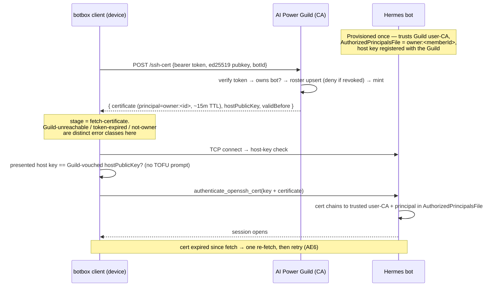
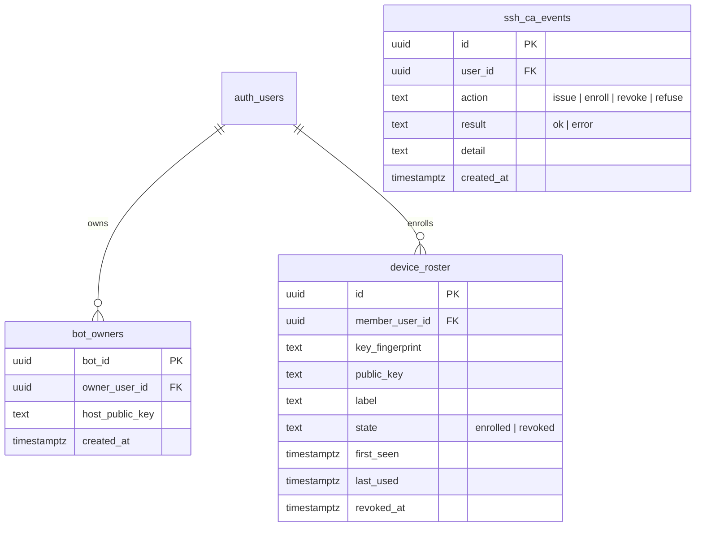

# feat: Guild-brokered SSH certificate authority for botbox

## Summary

Make the AI Power Guild an SSH certificate authority so any device a member is
signed into can reach that member's Hermes bot with no manual key handling. A
botbox client fetches a short-lived Guild-signed user certificate (authenticated
by its existing Guild bearer token), then connects over public SSH using that
certificate. Bots are provisioned once to trust the Guild CA and never change as
devices come and go. This plan delivers the end-to-end v1 path across both
repos — the Guild CA, cert-issuance endpoint, device roster, and bot-owner
registry in **aisupply**; the cert-fetch and certificate-auth flow in the
**botbox** client; and the bot-trust contract in botbox's deploy scripts.

This plan spans two repositories. The plan's home is **botbox**, so unmarked
file paths are botbox-relative. Units that land in the Guild web app are tagged
`**Target repo:** aisupply` and use aisupply-relative paths.

---

## Problem Frame

A Hermes bot runs on a public-IP Hetzner VPS reachable only by SSH key. Today a
bot is born with exactly one public key baked into cloud-init
(`deploy/hetzner/cloud-init.yaml` substitutes a single `__SSH_PUBLIC_KEY__`).
There is no path to authorize a second device after boot without hand-editing
`authorized_keys` over an already-working session — the exact case that fails:
one member, several devices, added over time, often from a device that has never
reached the bot. The Guild already authenticates every member and (in the future
provisioning build) creates every bot, so it is the natural trust broker. The
missing piece is a path from "signed into the Guild" to "allowed onto my bot"
that scales to many devices without touching the bot each time.

Research confirmed the work is largely greenfield on both sides: botbox has **no
HTTP client, no bearer-token handling, and no Guild connectivity at all** today,
and aisupply has **no bot, SSH, or CA infrastructure**. The connect pipeline and
the `Signer` seam in botbox are mature and opinionated, so the main client-side
risk is composing the new cert flow with the existing staged-error taxonomy
without collapsing the failure distinctions R13/AE5 require.

---

## Key Technical Decisions

- KTD1. **One combined, phased plan; Guild side lands first.** The client depends
  on the cert endpoint existing, so Phase 1 (Guild CA + endpoint + roster +
  registry) precedes Phase 2 (botbox client) and Phase 3 (bot-trust contract).
  The issued-certificate JSON is the interface between the two repos; it is pinned
  here and asserted by a shared fixture on both sides (U3, U5). The endpoint
  responds camelCase `{ certificate, hostPublicKey, hostKeyVouched, validBefore }`
  where `validBefore` is unix seconds (integer); the botbox `IssuedCert` struct
  carries `#[serde(rename_all = "camelCase")]` to bind it. `principal` is
  server-internal and not part of the client contract.

- KTD2. **HTTP to the Guild lives in Rust (`reqwest`), not the webview.** botbox
  has no HTTP client today, and `src-tauri/src/lib.rs` asserts no `http:` webview
  capability is granted. Adding `reqwest` (rustls backend) in the Rust backend
  keeps the "networking in Rust, webview sandboxed" posture and leaves the
  capability allowlist test untouched. `tauri-plugin-http` is rejected because it
  would force relaxing that assertion.

- KTD3. **Certificate auth threads through a narrow, cert-only `Signer` method**
  that materializes a transient, zeroizing `Arc<ssh_key::PrivateKey>` for the
  `authenticate_openssh_cert` call only — not a general private-key getter. russh
  0.54.5's certificate path takes a raw in-memory key and has no external-signer
  variant; the trait's no-private-egress invariant is preserved by scoping the
  materialization to the cert path and zeroizing after use. A non-extractable
  (future Secure-Enclave) signer returns an error from this method, so cert auth
  fails fast with a clear message rather than silently downgrading.

- KTD4. **A new `fetch-certificate` connect stage with its own error classes,
  mirrored 1:1 into the frontend.** Prepended before `tcp-connect`. New
  `ConnectErrorKind` variants (`GuildUnreachable`, `GuildAuthExpired`,
  `NotOwner`, `GuildSigningFailure`, `CertExpired`) preserve R13/AE5's three-way
  distinction (Guild-unreachable vs bot-unreachable vs auth-rejection). The enum
  is mirrored in `src/state.ts`; every new variant gets a frontend string and a
  rendered surface, mirroring the existing `LocalSignerFailure`-vs-
  `RemoteAuthFailure` discipline.

- KTD5. **No-prompt host trust via a Guild-vouched host key, not a true host
  certificate.** Stock russh 0.54.5 never negotiates `*-cert-v01` host keys and
  `check_server_key` only ever receives a plain public key, so literal host-cert
  validation needs a fork. Instead the cert-issuance response also returns the
  bot's expected host public key; `check_server_key` compares the presented host
  key against that Guild-vouched key through the existing `HostKeyDecider` seam,
  removing the trust-on-first-use prompt (AE4). TOFU remains the fallback for
  bots with no vouched key (pre-provisioning). True `@cert-authority` host-cert
  validation is deferred with the overlay/fork.

- KTD6. **Server-side certificates are minted in pure JS with `sshpk`, injecting
  `permit-pty` explicitly.** This runs on Vercel without `ssh-keygen`. `sshpk`'s
  `Certificate.create` leaves the OpenSSH extensions field empty, so an interactive
  shell silently fails to get a PTY unless `permit-pty` is added by hand — a
  load-bearing gotcha closed by a PTY integration test. A hand-rolled
  `node:crypto` blob is the documented fallback and the future KMS path.

- KTD7. **Short user-cert TTL with a backdated start; per-member principal;
  deny-future-issuance revocation.** User certs get ~15-minute validity with
  `valid_after` backdated ~5 minutes for clock skew, re-minted per connect. The
  principal is `owner:<memberId>` (one cert spans all of a member's bots) and is
  accepted on each bot via `AuthorizedPrincipalsFile`. User-CA and host-CA keys
  are **separate** (independent blast radius and rotation) and stored as env
  secrets for v1 (KMS later). A real serial and a meaningful key-id are always
  set so a KRL is a clean later addition. No KRL in v1.

- KTD8. **The device roster uses a tombstone (revoked state), not row deletion,
  so revocation is sticky.** First-request auto-enroll keys on
  `(member_id, key_fingerprint)` with an idempotent upsert; a revoked key that
  re-requests is denied, not silently re-enrolled (otherwise AE3 is defeated).
  Issuance order is verify-token → verify-ownership → read roster (deny if
  `revoked`) → re-check revocation atomically immediately before signing → mint →
  upsert roster (enroll + `last_used`) **only on a successful mint**. So a refused
  or failed request never leaves a dangling roster entry, and a revoke landing
  mid-request cannot mint a fresh certificate.

- KTD9. **A Guild bot-id links the client `Bot` record to the Guild's bot-owner
  registry.** The cert request names a target bot by its Guild id; the registry
  maps bot-id → owner (and the bot's vouched host key) for the ownership check.
  Populating the registry is the seam where the deferred provisioning build
  connects; v1 uses a minimal insert path so the endpoint is testable.

---

## High-Level Technical Design

Certificate issuance and connect, with the Guild-vouched host key replacing TOFU:

Guild-side data model (aisupply, migration `0025_ssh_ca.sql`):

`device_roster` has a unique index on `(member_user_id, key_fingerprint)`; all
three tables are RLS default-deny (service-role only), mirroring the existing
`forgejo_users` / `forgejo_sync_events` pattern.

---

## Requirements

Carried from the origin brainstorm (`docs/brainstorms/2026-06-28-guild-ssh-cert-auth-requirements.md`),
with R8 adjusted per KTD5.

**Guild certificate authority**

- R1. The Guild holds an SSH **user**-CA keypair and a separate **host**-CA
  keypair; the private signing keys are server-side secrets that never leave the
  Guild.
- R2. The Guild exposes an authenticated endpoint that, given a Guild bearer
  token, an ed25519 client public key, and a target bot, returns a short-lived
  Guild-signed user certificate plus the bot's vouched host public key.
- R3. Certificates are short-lived (~15-minute TTL, backdated start) and
  re-requestable per session, scoped by a `owner:<memberId>` principal so a
  certificate authenticates only to bots the requesting member owns.
- R4. The Guild signs only for bots the authenticated member owns; a request
  naming a bot the member does not own (or that does not exist) is refused
  without issuing a certificate and without writing a roster entry (AE2).

**Bot trust configuration**

- R5. Each bot is provisioned to trust the Guild user-CA for authentication via
  `TrustedUserCAKeys`, with the owner's principal accepted through
  `AuthorizedPrincipalsFile`.
- R6. After provisioning, a bot needs no per-device key changes as the owner adds
  or removes devices, and stores no per-client public keys.
- R7. The bot keeps certificate/pubkey-only SSH (no passwords); public port 22
  stays reachable but admits only valid Guild-signed certificates.
- R8. The bot's host key is registered with the Guild at provisioning and
  returned to the client at cert issuance; botbox pins the presented host key
  against that vouched key, so a new device's first connection shows no
  trust-on-first-use prompt (AE4). (Adjusted from a literal host certificate per
  KTD5; the no-prompt outcome is unchanged.)
- R9. R5–R8 define the contract; building Guild-driven Hetzner bot creation is
  out of scope (Phase 3 delivers the cloud-init/provision-script form of this
  contract so a bot can be stood up to test end-to-end).

**Client certificate flow**

- R10. A botbox client keeps its existing locally-held ed25519 key and obtains a
  certificate for that key from the Guild before connecting.
- R11. The client presents key + certificate during SSH publickey auth and, on
  certificate expiry, requests one fresh certificate and retries rather than
  failing permanently (AE6).
- R12. Certificate acquisition uses the device's Guild bearer token as its
  authentication — no separate per-bot credential.
- R13. When the Guild is unreachable and the client holds no unexpired
  certificate, the attempt fails with an error distinct from wrong-address,
  unreachable-bot, expired-token, and auth-rejection failures (AE5).

**Device enrollment and revocation**

- R14. Any device signed into the Guild can obtain certificates for the owner's
  bots immediately; there is no separate per-device approval step.
- R15. The Guild records each enrolled device as an individually visible roster
  entry (key fingerprint, label, first-seen, last-used).
- R16. The owner can revoke a single device; a revoked device can no longer
  obtain new certificates, and other devices are unaffected (AE3).
- R17. Revocation takes effect within one certificate TTL; a revoked device's
  last certificate remains valid until it expires; instant global revocation
  (KRL) is deferred.

**Composition with later hardening**

- R18. Certificate auth, enrollment, and revocation stay independent of the
  transport, so a later overlay / no-public-SSH phase can move the transport
  beneath them without changing the CA, the roster, or the cert flow.

---

## Implementation Units

### Phase 1 — Guild CA, issuance, roster, registry (aisupply)

### U1. SSH certificate minting library

**Target repo:** aisupply
**Goal:** Build and sign OpenSSH user certificates (and load the host-CA for
host-key vouching) in pure JS, runnable on Vercel.
**Requirements:** R1, R3.
**Dependencies:** none.
**Files:** `lib/ssh-ca/mint.ts`, `lib/ssh-ca/config.ts`, `package.json`
(+`sshpk`, `-D @types/sshpk`), `.env.example`, `lib/ssh-ca/mint.test.ts`.
**Approach:** `config.ts` loads the **user-CA private** key (the only signing key
v1 uses), the **host-CA public** key, the TTL (~15m), skew margin (~5m), and the
`owner:<memberId>` principal template. The host-CA *private* key is NOT loaded in
v1 — KTD5 returns each bot's registered host key, not a CA-signed host cert, so a
host-CA private signer has no v1 consumer (deferred to the host-cert phase). The
loader validates key format and throws a generic `invalid CA key configuration`
error that never echoes the env value, and wraps the loaded key in a
non-`Debug`/non-`Display` type from first read. `mint.ts` exposes
`mintUserCert({ subjectPublicKey, memberId, serial, keyId })` returning the
OpenSSH cert string: type=user, principals=`[owner:<memberId>]`,
`valid_after = now − skew`, `valid_before = now + ttl`, real serial, audit key-id
(`guild:user:<memberId>:device:<fpr>`). Inject `permit-pty` (and
`permit-port-forwarding` if tunnels are needed) into the extensions field
explicitly before signing. Sign with the user-CA key via sshpk's `node:crypto`
path. Pin the `sshpk` version.
**Patterns to follow:** `node:crypto` usage in `lib/forgejo/tokens.ts`; env-secret
loader shape in `lib/config.ts`.
**Test scenarios:**
- Covers R3. Mint a user cert, read it back (sshpk parse): type=user,
  principal=`owner:<id>`, serial nonzero, key-id present, `valid_after` backdating
  applied, `valid_before` ≈ now+TTL.
- `permit-pty` is present in the parsed extensions (guards the silent-no-shell
  gotcha).
- **Integration:** open a PTY over SSH using a minted cert against a throwaway
  `sshd` configured with `TrustedUserCAKeys = <user-CA pub>` and an
  `AuthorizedPrincipalsFile` containing `owner:<id>` — asserts a real interactive
  shell, not just auth success.
- Missing/garbage CA key in env → mint throws a clear error, no partial output.
- A malformed CA key value yields an error whose message contains no substring of
  the input — no key material reaches logs.
**Execution note:** Start with the PTY integration test — the `permit-pty`
omission authenticates fine and only fails at shell allocation, so a unit test on
the cert fields alone would pass while real sessions break.

### U2. Bot-owner registry and device-roster schema

**Target repo:** aisupply
**Goal:** Persist bot ownership (+ vouched host key) and the device roster with
sticky revocation.
**Requirements:** R4, R8, R15, R16, R17.
**Dependencies:** none.
**Files:** `supabase/migrations/0025_ssh_ca.sql`, `lib/db/types.ts` (regenerate).
**Approach:** Create `bot_owners` (bot_id PK, owner_user_id FK→auth.users,
host_public_key, created_at), `device_roster` (id PK, member_user_id FK,
key_fingerprint, public_key, label, state `check (state in ('enrolled','revoked'))`
default `enrolled`, first_seen, last_used, revoked_at) with a unique index on
`(member_user_id, key_fingerprint)`, and `ssh_ca_events` (audit). RLS default-deny
on all three; revoke all grants from anon/authenticated. Revocation flips
`state`/`revoked_at`, never deletes (a deleted row is indistinguishable from
never-enrolled).
**Patterns to follow:** `supabase/migrations/0022_forgejo_backend.sql`
(`forgejo_users` + `forgejo_sync_events`, RLS default-deny, `snake_case`,
`timestamptz`).
**Test scenarios:**
- The unique `(member_user_id, key_fingerprint)` index rejects a duplicate
  enrollment row.
- The `state` check constraint rejects a value other than `enrolled`/`revoked`.
- RLS denies a direct anon/authenticated select on all three tables.
**Execution note:** none — schema unit; `lib/db/types.ts` is regenerated, not
hand-edited.

### U3. Certificate-issuance endpoint

**Target repo:** aisupply
**Goal:** Authenticated endpoint that verifies ownership, auto-enrolls the device,
and returns a minted cert plus the vouched host key.
**Requirements:** R2, R3, R4, R12, R14.
**Dependencies:** U1, U2.
**Files:** `app/api/account/ssh-cert/route.ts`, `lib/ssh-ca/roster.ts`,
`app/api/account/ssh-cert/route.test.ts`, `tests/bearer-auth.test.ts` (add this
route to the `BEARER_ALLOWLIST` — the enumeration test fails otherwise).
**Approach:** POST handler: `requireBearerOrCookieUser` → Zod-parse
`{ botId, publicKey, deviceLabel? }` with a body-size cap and an ed25519-only key
check → look up `bot_owners` for `botId` and assert `owner_user_id == user.id`
(respond identically for not-found and not-owned, disclosing neither) → read the
roster for `(member, fingerprint)` and deny when `state='revoked'` → re-check
revocation atomically immediately before signing → `mintUserCert` (U1) → on
success, idempotent roster upsert on `(member, fingerprint)` that enrolls and
stamps `last_used = now()` → respond camelCase `{ certificate, hostPublicKey,
hostKeyVouched, validBefore }` (the pinned contract, KTD1) with `Cache-Control:
no-store`; `hostKeyVouched` is true when `bot_owners.host_public_key` is set.
Write an `ssh_ca_events` row per action, recording the key **fingerprint** in
`detail`, never the raw key blob. Enforce a per-member issuance rate limit
(sliding-window counter) so one bearer token cannot loop the signer. Map failures
to distinct status codes: 401 token, 403 not-owner, 422 bad key, 429
rate-limited, 500 signing failure.
**Patterns to follow:** `app/api/account/git-access/route.ts` (auth gate, mint,
no-store, audit-event write); `lib/auth/bearer.ts` return-shape handling.
**Test scenarios:**
- Covers AE2 / R4. Request a bot owned by someone else → 403, no cert, roster row
  count unchanged.
- Request a non-existent bot id → refused identically to not-owned (no existence
  disclosure), no roster write.
- Covers R14. First-ever request from a new key → roster entry created and a cert
  returned in one call.
- Two concurrent first requests for the same `(member, key)` → exactly one roster
  row afterward, both return a valid cert, no duplicate-key error surfaces.
- Expired/invalid bearer token → 401, no cert, no roster write.
- Malformed key, RSA/P-256 key, and multi-megabyte blob → 422 (or size-reject)
  before signing, message contains no key material.
- Covers R17. A key whose roster state is `revoked` re-requests → denied, not
  re-enrolled.
- Signing fails after ownership+roster checks pass → 500 (retryable) and the
  roster shows no dangling enroll (enroll persists only on successful issue).
- A member with zero bots requests any bot id → refused (not-owner path), no
  roster write.
- A successful issuance advances `last_used` on the device's roster row.
- `ssh_ca_events.detail` on every path (including 422/500) contains no substring
  of the submitted public key — fingerprint only.
- More than the allowed issuances per member per window → 429, no extra signing.

### U4. Roster list and revoke endpoints

**Target repo:** aisupply
**Goal:** Let an owner see their devices and revoke one.
**Requirements:** R15, R16, R17.
**Dependencies:** U2.
**Files:** `app/api/account/devices/route.ts`, `lib/ssh-ca/roster.ts`,
`app/api/account/devices/route.test.ts`.
**Approach:** This is a **web-app (cookie-session) surface**, matching actor A1
("manages their device roster in the Guild web app") — it must NOT import the
bearer helper, so a stolen botbox token cannot revoke the very device used to
detect or recover from the theft (the `disconnect-devices` invariant). GET lists
the caller's `enrolled` roster entries (fingerprint, label, first-seen,
last-used) scoped to `member_user_id = user.id`. DELETE (or POST with an action)
sets `state='revoked'`, `revoked_at=now()` for the named entry **only when
`member_user_id = user.id`** — the admin client bypasses RLS, so this WHERE clause
is the authorization; without it any member could revoke another's device by id.
Idempotent; writes an audit event. Revocation touches only the Guild roster — no
bot-side state.
**Patterns to follow:** `app/api/account/disconnect-devices/route.ts` (cookie-only
revoke); `app/api/account/git-access/route.ts` DELETE revoke shape.
**Test scenarios:**
- Covers R15. GET returns one row per enrolled device with label and timestamps;
  revoked rows are excluded (or flagged) per the chosen view contract.
- Covers AE3 / R16. Revoking device K2 flips only K2 to `revoked`; K1 and K3 stay
  `enrolled` and still issue certs.
- Revoke is idempotent — revoking an already-revoked entry succeeds without error.
- A revoked entry cannot re-enroll on a later cert request (cross-checks U3).
- Member B attempts to revoke member A's roster entry by id → 404, A's row
  unchanged (the member-scoped WHERE clause blocks cross-member revoke).
- The route does not import the bearer helper (cookie-only); a bearer-only caller
  is rejected.

### Phase 2 — botbox client certificate flow (botbox)

### U5. Guild HTTP client and bearer-token holding

**Goal:** A Rust module that holds the Guild bearer token and fetches a
certificate, with a typed result and typed errors.
**Requirements:** R10, R12, R13.
**Dependencies:** U3 (endpoint contract; developed against a mock).
**Files:** `src-tauri/Cargo.toml` (+`reqwest`, rustls), `src-tauri/src/guild/mod.rs`,
`src-tauri/src/guild/client.rs`, `src-tauri/src/guild/guild_test.rs`,
`src-tauri/src/commands.rs`, `src-tauri/src/lib.rs`.
**Approach:** `reqwest` client over **HTTPS only** (rustls WebPKI roots), scoped
to the Guild host. "Pinned to the Guild host" means the client only contacts that
hostname; TLS *certificate* pinning is deferred and the residual rogue-CA risk is
recorded in Risks. Secure token storage reuses the Keychain `KeyStore` shape (a
parallel secret item) with `set_guild_token` / `clear_guild_token` /
`guild_status` commands — see the Windows storage decision in Open Questions.
`fetch_certificate(guild_bot_id, public_openssh) -> Result<IssuedCert, GuildError>`
where `IssuedCert` carries `#[serde(rename_all = "camelCase")]` and binds the
pinned contract `{ certificate, host_public_key, host_key_vouched, valid_before }`
(`valid_before` is unix seconds, `i64`); `GuildError` variants map to the KTD4
error classes (unreachable, auth-expired, not-owner, signing-failure). For v1 the
token is set by pasting it from the Guild web app; a richer OAuth/device-code
login is deferred (see the onboarding decision in Open Questions).
**Patterns to follow:** `keychain.rs` (`KeyStore` trait + Memory/Keychain impls,
`default_key_store`); `commands.rs` per-call store construction and command
registration in `lib.rs`.
**Test scenarios:**
- Happy path against a hermetic mock Guild HTTP server → returns `IssuedCert` with
  certificate + host key parsed.
- 401 → `GuildError::AuthExpired`; connection-refused/timeout →
  `GuildError::Unreachable`; 403 → `GuildError::NotOwner`; 5xx →
  `GuildError::SigningFailure` — each distinct.
- Token round-trips through the secure store; a missing token yields a distinct
  pre-flight error (no HTTP attempted).
**Execution note:** Stand up an in-process mock Guild server in the test, mirroring
the in-process russh server in `connection_test.rs`.

### U6. Cert-aware `Signer` seam

**Goal:** Let the cert-auth path obtain a transient, zeroizing in-memory private
key without widening the trait's private-key egress.
**Requirements:** R10, R11.
**Dependencies:** none.
**Files:** `src-tauri/src/ssh/signer.rs`, `src-tauri/src/ssh/signer_test.rs`.
**Approach:** Add one narrow method to `Signer` (e.g. `certificate_signing_key()
-> Result<CertKey, SignerError>`) returning a wrapper around `Arc<ssh_key::PrivateKey>`
held in a zeroize-on-drop guard, materialized via the existing `load_private`
shape and dropped after the auth call. The default trait impl returns a
"certificate auth requires a software-held key" error so non-extractable signers
fail fast. No general `private_key()` getter is added; the existing no-egress
invariants hold. The returned key must be the type `authenticate_openssh_cert`
accepts — `russh::keys::ssh_key::PrivateKey` (russh vendors a *fork* of `ssh-key`),
a distinct Rust type from the store's top-level `ssh-key` 0.6.7. Cross the seam as
an OpenSSH string exactly as `connection.rs`/`known_hosts.rs` already do for host
keys: `to_openssh` on the loaded key, then `from_openssh` into the fork type
(`load_private`'s top-level `PrivateKey` does NOT coerce at the call site).
**Patterns to follow:** `Ed25519Signer::load_private`, `SecretBytes`
(zeroize-on-drop, redacting `Debug`), and the OpenSSH-string fork seam in
`connection.rs:242` / `known_hosts.rs`.
**Test scenarios:**
- The ed25519 signer yields a usable `Arc<PrivateKey>` whose public half matches
  `public_openssh()`.
- The existing invariants still hold: no `Signer` method returns raw private
  material except the explicit export path (assert the new method returns the
  zeroizing wrapper, not bytes).
- A fake non-extractable signer returns the fast-fail error, not a panic.

### U7. Certificate auth in the connect pipeline + error taxonomy

**Goal:** Authenticate with `authenticate_openssh_cert`, add the
`fetch-certificate` stage and new error kinds, and re-fetch once on cert expiry.
**Requirements:** R11, R13.
**Dependencies:** U5, U6.
**Files:** `src-tauri/src/ssh/pipeline.rs`, `src-tauri/src/ssh/pipeline_test.rs`,
`src-tauri/src/ssh/connection.rs`, `src-tauri/src/ssh/connection_test.rs`,
`src/state.ts`.
**Approach:** Extend `ConnectStage` with `FetchCertificate` and `ConnectErrorKind`
with `GuildUnreachable`, `GuildAuthExpired`, `NotOwner`, `GuildSigningFailure`,
`CertExpired`; keep `default_kind_for_stage` exhaustive. Mirror every variant into
the `src/state.ts` `ConnectionErrorKind` union with a 1:1 string. Change `connect`
to take an `IssuedCert` and call `authenticate_openssh_cert(user, cert_key, cert)`
(via U6) instead of `authenticate_publickey_with`; `cert` is parsed from the Guild
cert string into `russh::keys::ssh_key::Certificate` (the same fork type U6
targets). `CertExpired` is detected by inspecting `valid_before` **client-side**
before presentation, not by reading the bot's rejection (sshd gives no distinct
wire signal). A not-yet-valid cert (bot clock ahead of the backdated
`valid_after`) is classified distinctly and does NOT trigger re-fetch — re-minting
cannot fix forward skew, so NTP on the bot (U10) is load-bearing here. On a
`CertExpired`-classified rejection, signal a single re-fetch to the caller
(R11/AE6) — exactly one, no loop.
**Patterns to follow:** existing `ConnectStage`/`ConnectErrorKind` 1:1 mapping and
`pipeline_test.rs`; the in-process server harness in `connection_test.rs`;
`LocalSignerFailure`-vs-`RemoteAuthFailure` separation.
**Test scenarios:**
- Covers R13 / AE5. Pure-data test: every new `ConnectErrorKind`/`ConnectStage`
  variant has a distinct frontend string and none collapses onto an existing
  bot-side kind.
- Cert auth succeeds against an in-process test server **extended to verify the
  presented certificate chains to the test CA and matches the principal** —
  russh's server `auth_publickey` only sees a plain key and does no CA/principal
  check, so the test harness must add it; true acceptance against real sshd is the
  U10 live-bot gate.
- An expired cert is detected client-side (`valid_before` in the past), classified
  `CertExpired` (distinct from `RemoteAuthFailure`), and triggers one re-fetch.
- A not-yet-valid cert (forward clock skew) is classified distinctly and does NOT
  re-fetch.
- Three-way distinction holds: Guild-unreachable (stage `fetch-certificate`) vs
  bot-unreachable (`tcp-connect` `Unreachable`) vs bot rejecting the cert
  (`authenticate` `RemoteAuthFailure`).
- A valid in-window cert presented to a server with no CA trust → rejected with a
  surface the operator can tell apart from cert-expiry (the bot-not-provisioned
  case, common while Phase 3 provisioning is partial).

### U8. Pinned host-key validation replacing TOFU for vouched bots

**Goal:** Skip the trust prompt by pinning the Guild-vouched host key; keep TOFU
for bots with no vouched key.
**Requirements:** R8.
**Dependencies:** U5, U7.
**Files:** `src-tauri/src/ssh/known_hosts.rs`,
`src-tauri/src/ssh/known_hosts_test.rs`, `src-tauri/src/ssh/connection.rs`,
`src-tauri/src/ssh/connection_test.rs`.
**Approach:** Thread the issued response's `host_public_key` and `host_key_vouched`
flag into `check_server_key`. When `host_key_vouched` is true, compare the
presented host key against the vouched key: match → `Known` (no prompt); differ →
a hard-stop mismatch class. When `host_key_vouched` is true but the key is missing
or blank (a stripped field), **hard-fail** — do NOT downgrade to a prompt, since
an active attacker could otherwise blank the field to force a TOFU prompt the
operator is conditioned to accept. Only when `host_key_vouched` is false
(genuinely pre-provisioning) fall through to the existing TOFU `HostKeyDecider`
path. Signing the vouched key with the host-CA at registration (so the endpoint
proves integrity before returning it) is a deferred hardening (Risks).
**Patterns to follow:** `HostKeyDecision` (`Known`/`Unknown`/`Mismatch`),
`HostKeyDecider::decide_openssh` crossing the seam as OpenSSH strings.
**Test scenarios:**
- Covers AE4. Presented host key equals the vouched key → connects with no prompt
  emitted.
- Presented host key differs from the vouched key → hard stop with a distinct
  class, no auto-trust.
- `host_key_vouched` false → the existing TOFU prompt path still runs (back-compat
  for pre-provisioning bots).
- `host_key_vouched` true with a missing/blank key → hard-fail, no TOFU prompt (an
  attacker cannot strip the field to force trust-on-first-use).
- A vouched bot whose host key later changes → mismatch, not silent update.

### U9. Wire the connect command to fetch a certificate first

**Goal:** Make `connect` fetch a cert (and vouched host key) before dialing, carry
the Guild bot-id, and surface the new errors/events to the UI.
**Requirements:** R10, R11, R12, R13.
**Dependencies:** U5, U7, U8.
**Files:** `src-tauri/src/store.rs`, `src-tauri/src/store_test.rs`,
`src-tauri/src/commands.rs`, `src-tauri/src/lib.rs`, `src/state.ts`,
`src/connection.ts`.
**Approach:** Add a `guild_bot_id` field to `Bot` (serde-optional for back-compat).
In the `connect` command: resolve the selected bot → ensure a Guild token →
emit the `fetch-certificate` stage → `guild::fetch_certificate(guild_bot_id,
public_openssh)` → pass the `IssuedCert` (cert + vouched host key) into
`connection::connect` → on `CertExpired`, re-fetch once and retry. Render the new
`connect-failed` kinds in the frontend.
**Patterns to follow:** the existing `connect` command (`commands.rs`) staged
`connect-stage` emission and event flow into `src/state.ts` / `src/connection.ts`;
`Bot` serde-default fields in `store.rs`.
**Test scenarios:**
- Happy path: connect fetches a cert, then connects, emitting `fetch-certificate`
  before `tcp-connect`.
- Guild-unreachable surfaces at `fetch-certificate` before any TCP to the bot.
- Covers AE6. Cert expired since fetch → one re-fetch → retry succeeds.
- A bot with no `guild_bot_id` yields a clear actionable error (not a generic
  failure).
- Frontend renders each new error kind distinctly.

### Phase 3 — bot-trust contract (botbox deploy scripts)

### U10. Bot-trust cloud-init contract

**Goal:** Provision a bot to trust the Guild user-CA, accept the owner principal,
register its host key, and run NTP — so a real bot can be stood up to test the
whole flow.
**Requirements:** R5, R6, R7, R8, R9.
**Dependencies:** U1 (user-CA public key exists), U2 (the `bot_owners` table the
host-key registration step writes to).
**Files:** `deploy/hetzner/cloud-init.yaml`, `deploy/hetzner/provision.sh`,
`deploy/hetzner/lib.sh`, `deploy/hetzner/README.md`.
**Approach:** Add the Guild user-CA public key as `TrustedUserCAKeys`, write
`/etc/ssh/auth_principals/hermes` containing `owner:<memberId>` via
`AuthorizedPrincipalsFile`, enable `chrony`/NTP, and register the bot's generated
host public key with the Guild's `bot_owners` record (a manual/script step for
v1). Keep single-key `authorized_keys` injection as a transitional fallback so a
pre-Guild bot still works. Guild-driven Hetzner bot creation remains deferred.
**Patterns to follow:** existing `cloud-init.yaml` user block and `provision.sh`
`__SSH_PUBLIC_KEY__` substitution.
**Test scenarios:** none — provisioning/config change. Verify by standing up a
test bot (the `src-tauri/tests/real_bot.rs` `#[ignore]` env-gated pattern):
`sshd` admits a Guild-signed cert with the owner principal and rejects a key the
CA did not sign; the client connects with no TOFU prompt against the vouched host
key. Optionally `shellcheck` the scripts.
**Execution note:** This unit is verified end-to-end against a live bot, not by
unit tests; treat the manual verification as the completion gate.

---

## Scope Boundaries

**Deferred for later**

- Guild-driven Hetzner bot creation and management (the provisioning build). Phase
  3 delivers the cloud-init/provision-script form of the trust contract; the
  Guild app does not yet create bots or populate `bot_owners` automatically.
- True `@cert-authority` OpenSSH host-certificate validation on the client (needs
  a russh fork). v1 uses the Guild-vouched host key (KTD5).
- Instant/global certificate revocation via a published KRL — v1 relies on short
  TTL + sticky roster revocation.
- Offline / cached-certificate connections when the Guild is unreachable. v1
  always re-fetches a certificate per connect, so an unreachable Guild always
  fails with `GuildUnreachable` regardless of any locally held unexpired cert —
  the "holds no unexpired certificate" branch of R13/AE5 is therefore moot in v1,
  and cached-cert reuse is deferred.
- A richer Guild login (OAuth / device-code) in botbox — v1 sets the bearer token
  by paste from the Guild web app.
- The no-public-internet WireGuard overlay (the next hardening phase R18 protects).

**Outside this product's identity**

- Multi-user or team sharing of a single bot — still one owner per bot.
- A general-purpose SSH certificate authority or device-management product — scoped
  to botbox ↔ Hermes-bot access.

**Deferred to follow-up work**

- A KMS/HSM home for the CA private keys (v1 uses env secrets; the loader in U1 is
  the seam to swap).
- Automatic population of `bot_owners` from the provisioning build (v1 uses a
  minimal insert path).
- A roster *size* cap (U3 adds a per-member issuance rate limit; a hard cap on
  enrolled devices is deferred — revisit if roster growth becomes a concern).
- TLS certificate pinning to the Guild host, and signing the vouched host key with
  the host-CA at registration (both deferred hardenings; see Risks).

---

## Risks & Dependencies

- **russh host-cert gap.** Stock russh 0.54.5 cannot validate host certificates;
  mitigated by the Guild-vouched host key (KTD5/U8). Revisit only if true
  host-cert validation becomes required (overlay phase).
- **`sshpk` is low-activity and the `permit-pty` omission is silent.** Pin the
  version, consider vendoring its ~200-line openssh-cert module, and own the PTY
  integration test (U1) that proves minted certs yield a shell.
- **Private key in memory for cert auth softens the `Signer` no-egress invariant.**
  Scoped to the cert path and zeroized (KTD3/U6); documented as closing the door
  on a Secure-Enclave + certificate combination until russh gains external-signer
  cert support.
- **CA private keys as env secrets in v1.** Separate user/host CA keys bound the
  blast radius; upgrade to KMS is a loader swap. Treat env-secret exposure as a
  known v1 risk. The loader must never echo a key on a parse/validation error (it
  would land in Vercel logs and compromise the CA) — U1 enforces a generic error,
  a non-`Debug` wrapper, and a no-echo test.
- **Guild TLS trust.** v1 relies on WebPKI/system-CA validation over HTTPS; TLS
  certificate pinning to the Guild host is deferred, so a rogue CA in the trust
  store could MITM the cert-fetch (capturing the bearer token, returning a forged
  cert). Accepted for v1; pin later if warranted.
- **Vouched host-key integrity.** The vouched key is trusted because its
  `bot_owners` row exists; a compromised admin client could poison it. Signing the
  vouched key with the host-CA at registration (so the endpoint validates before
  returning) is a deferred hardening; U8's hard-fail-on-strip rule prevents the
  related downgrade-to-TOFU attack now.
- **Clock skew on short-TTL certs.** Backdated `valid_after` (~5m) plus NTP on
  bots (U10); a TTL floor keeps a cert from being born already-expired.
- **Bot-owner registry population depends on the deferred provisioning build.** v1
  needs a minimal insert path or the ownership check (R4) has nothing to read.
- **botbox has no Guild login today.** Token acquisition is net-new; v1 uses a
  pasted token, which is a real (if minimal) new surface to secure.
- **Cross-repo contract drift.** The `IssuedCert` JSON shape is the interface;
  changing it requires touching both repos. The error taxonomy is mirrored 1:1
  between `pipeline.rs` and `src/state.ts`.
- **Roster growth is bounded only by a rate limit in v1.** U3 adds a per-member
  issuance rate limit, so a single token cannot loop the roster; a hard *size* cap
  on enrolled devices is deferred.
- **Windows holds the bearer token in memory only.** macOS uses the Keychain;
  Windows' `default_key_store` is memory-only, so a pasted token would sit in
  process heap until a Windows Credential Manager (DPAPI) store lands — see the
  Open Questions decision.

---

## Open Questions

Deferred to implementation; each has a working default.

- **Guild token-acquisition UX for v1.** Default: paste a bearer token from the
  Guild web app into botbox; OAuth/device-code login deferred. This is the largest
  gap against the brainstorm's zero-friction promise — pasting a token on a new
  phone is itself manual credential handling. Decide whether v1 ships paste-token
  or a minimal device-code login.
- **Bearer-token storage on Windows.** macOS uses the Keychain; Windows'
  `default_key_store` is memory-only today. Decide: add a Windows Credential
  Manager (DPAPI) store for the token, or document and accept the memory-only risk
  for Windows v1.
- **Un-provisioned-bot member story.** Until the provisioning build populates
  `bot_owners`, a member can hold a valid cert and still be refused (bot not in
  registry) or rejected (bot not yet CA-trusting). Decide the member-facing message
  and next action for these early states, beyond distinguishing the error classes.
- Whether the vouched host key rides in the cert-issuance response or a separate
  bot-info call — default: inline in the issuance response (one round trip).
- Roster device-label source — default: client-supplied label on first request,
  falling back to a generated name.
- Whether botbox caches the vouched host key per bot or relies on the per-connect
  issuance response — default: rely on the per-connect response (no separate
  cache) for v1.
- CA key rotation runbook specifics (overlap window, who rotates) — default:
  additive rotation leaning on the short TTL; document when the loader moves to
  KMS.

---

## Acceptance Examples

- AE1. Covers R5, R6, R14 (U3, U10). A member signs into the Guild on a brand-new
  device and connects to a bot provisioned weeks earlier; the bot's configuration
  is unchanged and admits the device.
- AE2. Covers R4 (U3). A request naming a bot the member does not own is refused
  with no certificate issued and no roster entry written.
- AE3. Covers R16, R17 (U4, U3). Revoking a lost laptop denies it new
  certificates, its last certificate still works until it expires, and the
  member's other devices keep connecting.
- AE4. Covers R8 (U8). The first connection from a new device to a bot whose host
  key the Guild vouches for shows no trust-on-first-use prompt.
- AE5. Covers R13 (U5, U7). With the Guild unreachable and no unexpired
  certificate, the connection fails with an error distinct from a wrong IP, an
  unreachable bot, an expired token, or a rejected key.
- AE6. Covers R11 (U7, U9). A client whose certificate expired requests one fresh
  certificate on the next connect and succeeds, rather than reporting a permanent
  auth failure.

---

## System-Wide Impact

- **New trust boundary.** The Guild becomes a signing authority; its user-CA
  private key (and the host-CA key once host-cert signing lands) is the
  highest-value new secret in aisupply.
- **First outbound HTTP from botbox.** Networking stays in the Rust backend
  (`reqwest`), pinned to the Guild host; the webview capability allowlist is left
  locked down (KTD2).
- **Error-taxonomy contract.** `ConnectErrorKind`/`ConnectStage` in `pipeline.rs`
  and the `ConnectionErrorKind` union in `src/state.ts` must change together.
- **Bot immutability preserved.** Revocation is Guild-roster-only; no bot is
  touched when a device is added or removed (R6), which the later overlay phase
  depends on (R18).

---

## Sources / Research

- `docs/brainstorms/2026-06-28-guild-ssh-cert-auth-requirements.md` — origin
  requirements; this plan implements its contract and adjusts R8 per KTD5.
- `src-tauri/src/ssh/connection.rs` — the staged connect pipeline,
  `SignerAdapter`, and the `check_server_key` TOFU path U7/U8 extend.
- `src-tauri/src/ssh/signer.rs` — the `Signer` no-egress invariant U6 preserves;
  `load_private` is the shape the cert key reuses.
- `src-tauri/src/ssh/pipeline.rs` + `src/state.ts` — the 1:1 error taxonomy U7
  extends.
- `src-tauri/src/store.rs`, `src-tauri/src/commands.rs`, `src-tauri/src/lib.rs` —
  bot inventory, the connect command, and command registration U9 wires.
- `deploy/hetzner/{cloud-init.yaml,provision.sh,lib.sh}` — today's single-key
  injection U10 extends to CA trust.
- russh 0.54.5 source: `client/mod.rs` `authenticate_openssh_cert` (in-memory key,
  no external-signer variant) and the client `Handler` (no host-cert validation
  hook) — the basis for KTD3 and KTD5.
- aisupply: `lib/auth/bearer.ts`, `app/api/account/git-access/route.ts`,
  `supabase/migrations/0022_forgejo_backend.sql`, `lib/config.ts` — the auth,
  per-device-credential, migration, and env-secret patterns Phase 1 mirrors.
- SSH-CA best practices (OpenSSH `PROTOCOL.certkeys`, ssh-keygen(1), sshd_config(5),
  Smallstep, Teleport, Netflix BLESS): separate user/host CAs, short TTL with
  backdated start, `AuthorizedPrincipalsFile`, deny-future-issuance, and the
  `sshpk` `permit-pty` minting gotcha — the basis for KTD6 and KTD7.
